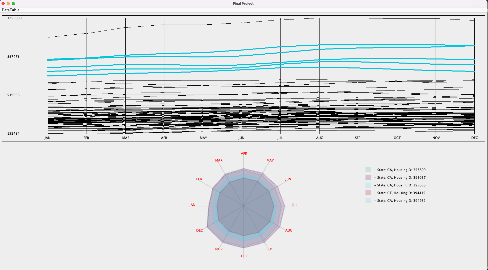

# Data Visualization

Created: March 3, 2022 12:36 PM

[GitHub] [https://github.com/spencerkwon92/DataVisualization](https://github.com/spencerkwon92/DataVisualization)

## Development Objectives.

- Create proper data visualization to get the fluctuation trend of data.
- Implement the Spider Chart to compare multiple data and show the specific single data.

## Explanation.

To develop this project, I thought about what is the most important factors in data visualization. I set the main three factors:

- Visualized data have to show the change trends to predict future events.
- Visualized data have to show specific data of each column or object.
- Visualized data have to compare one object to other objects.

To fulfill these standards, I choose the Parallel Coordinates and Spider chart to show the data. I use Parallel Coordinates to show the trends of data change and Spider chart to show the comparisons and specific data.

This is a data table that has 2019 housing prices data in the US. Each row is the one housing information. I saved each row as one object(class name: Housing) and create List to save all the rows.

To draw the data using paintComponent, I transformed each month's price data by creating a helper method called `numberTransform`. Here is the logic for transforming the data:

$RealDataPosition =length Of YAxis (\frac{price - Minimum}{Maximum - Minimum}\times lengthOfYAxis)$

To implement the Spider Chart, I used the following logic:

This is the diagram that describes the one position of the data. Using the trigonometric function, I could find the pattern of each x coordinate and y coordinate.

$xCoordinate = sin(angle)\times transformedData$

$yCoordinate = cos(angle)\times transformedData$

*The angle increased by $30\degree$for each data.* 

I also used `MouseInputListener` object to show the specific data and comparison data that users want to see. 

## Result.

Showing trend of each housing price change for each month.

Showing each housing information. When users hover the mouse pointer on each line, it shows specific housing data at the spider chart.

Users are able to choose multiple lines to see the comparison of each line. When they choose the data, it shows the comparison data and data that they choose in the Spider Chart area.

## Reference.

[https://www.zillow.com/](https://www.zillow.com/)
